## 들어가며

Mozilla가 아시아를 돌면서 강연한 영상은 [여기](https://developer.mozilla.com/videos/developer-roadshow-asia-2019-playlist/) 나와있습니다!

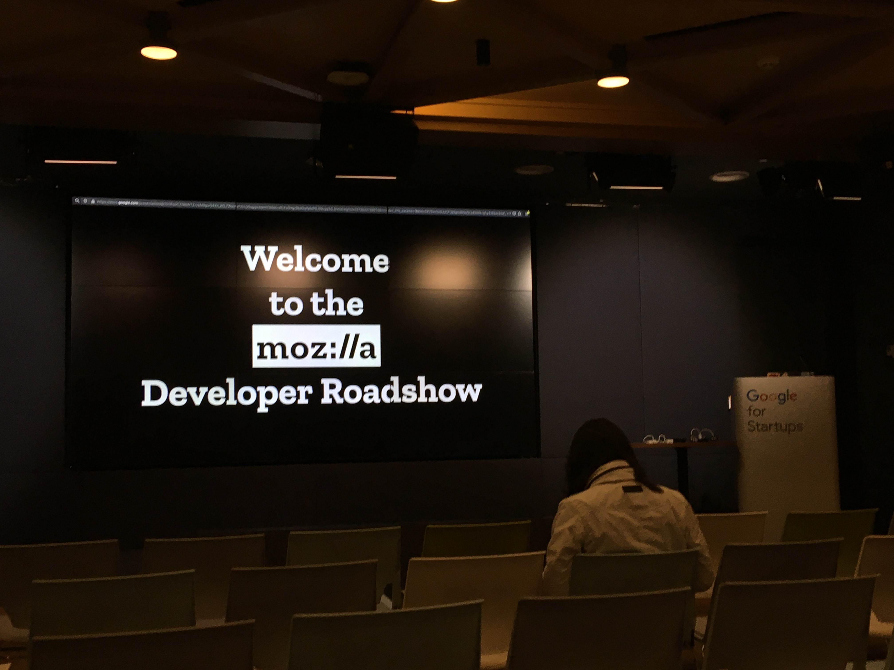
_Mozilla Developer Roadshow! 11월 13일 구글 스타트업 캠퍼스에서 열렸다._

HTML5 Conference 2019에서 봤었던 많은 Web 기술들을 보고 미래에 적용할 기술들을 맛보고 싶어서 신청했다.

모든 발표는 영어로 진행되었지만.. PPT에 약간의 한국어가 있었고 발표자 분들 중 처음에 한국어로 인사한 분도 계셨다는게 인상깊었다.

아래 내용들은 들으면서 정리한 내용(빠진 부분이 있을수도..) + 찾아본 내용이 합쳐져 있다. 오류가 있으면 지적해주시면 좋겠습니다 :)

## FireFox의 새로운점?

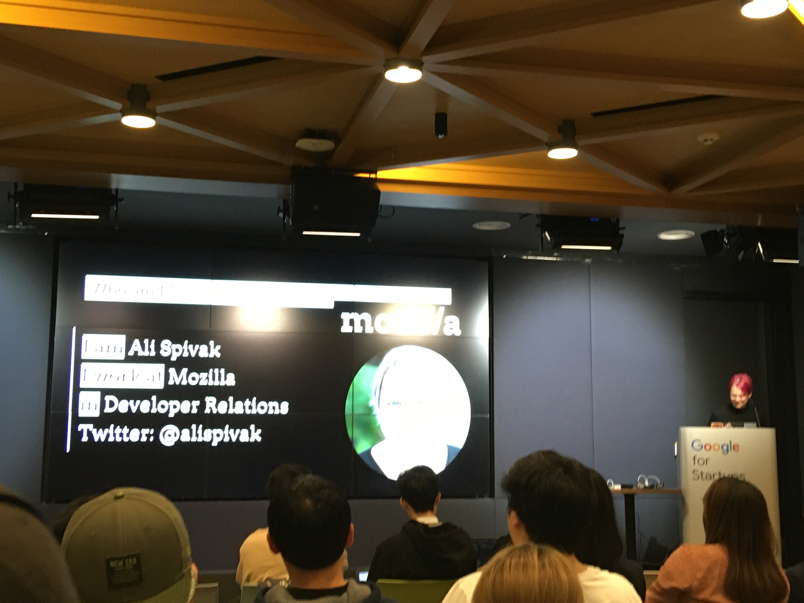
_Ali Spivak라는 분이 발표하셨다. <s>빛이...</s>_

### 새로운 버전...이 아니라 새로운 로고!

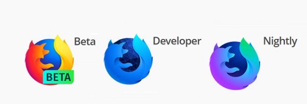

최신 기능이 적용되어 미리 테스트 해볼 수 있는 Nightly Version과 Nightly Version에서 충분히 안정화된 기능을 갖고 온 Developer Version의 로고가 바뀌었다!

### 다크모드를 감지하는 CSS가 생겼다.

<a href="https://developer.mozilla.org/ko/docs/Web/CSS/@media/prefers-color-scheme" target="_blank">prefer-color-scheme</a> 미디어 쿼리로 사용자가 다크모드를 사용하는지 감지할 수 있다.

### Secure password

회원가입할 때 오른쪽 클릭을 하고 안전하게 생성된 비밀번호를 누르면 랜덤으로 비밀번호가 생성된다. 그리고 저장된 비밀번호가 겹치면 경고를 띄운다.

### underline CSS 다양화

- <a href="https://developer.mozilla.org/en-US/docs/Web/CSS/text-underline-offset" target="_blank">text-underline-offset</a>: 밑줄의 위치를 설정한다.
- <a href="https://developer.mozilla.org/en-US/docs/Web/CSS/text-decoration-thickness" target="_blank">text-decoration-thickness</a>: 밑줄의 두께를 정할 수 있다.
- <a href="https://developer.mozilla.org/en-US/docs/Web/CSS/text-decoration-skip-ink" target="_blank">text-decoration-skip-ink</a>: 보통 밑줄을 그을 경우 글자가 있는 부분의 밑줄은 생략된다. 하지만 이 속성이 none 값을 가지게 되면 생략을 하지 않게 된다.

위와 같이 underline에 대한 CSS를 다양화하였다.

### scroll snapping

<a href="https://developer.mozilla.org/en-US/docs/Web/CSS/scroll-snap-type" target="_blank">scroll-snap-type 속성</a>으로 설정한 컨테이너에 컨테이너에 꽉찬 요소들을 넣으면 자연스럽게 스크롤 할 수 있게 된다.

### Javascript 디버거 / 콘솔

HTML 요소를 보는 탭(검사기)에서 DOM 아래와 같이 변경될 때 DOM 변경을 일시중지하고 해당 DOM을 변경한 코드로 가게 한다.

- 하위 트리 수정
- 속성 수정
- 노드 제거

접근성 검사기로 현재 페이지의 접근성 트리를 확인하고 웹 접근성이 좋은지 체크할 수 있다.

그 이외에도 많은 기능들이 있다(다른 세션에서 발표 예정이다).

### Privacy & Security
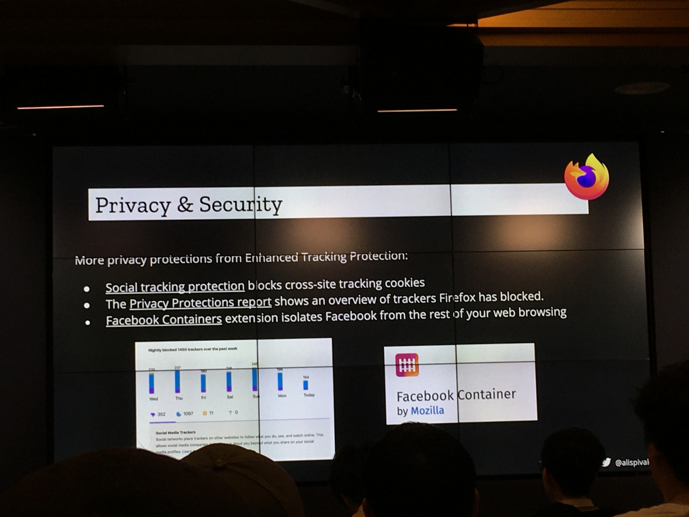
소셜 미디어 추적기나 교차 사이트 추적 쿠키를 방지하는 기능을 활성화 해서 추적을 방지한다. 
기본으로 추적을 방지하는 기능을 주고 추가로 Facebook Container이라는 부가기능을 통해 Facebook 공유 버튼, 좋아요 버튼이 있는 페이지에서 생기는 Tracking을 방지한다. 

autoplay Block을 활성화 해서 동영상이 자동으로 재생되는 것을 방지한다.

## Mozlia WebThings

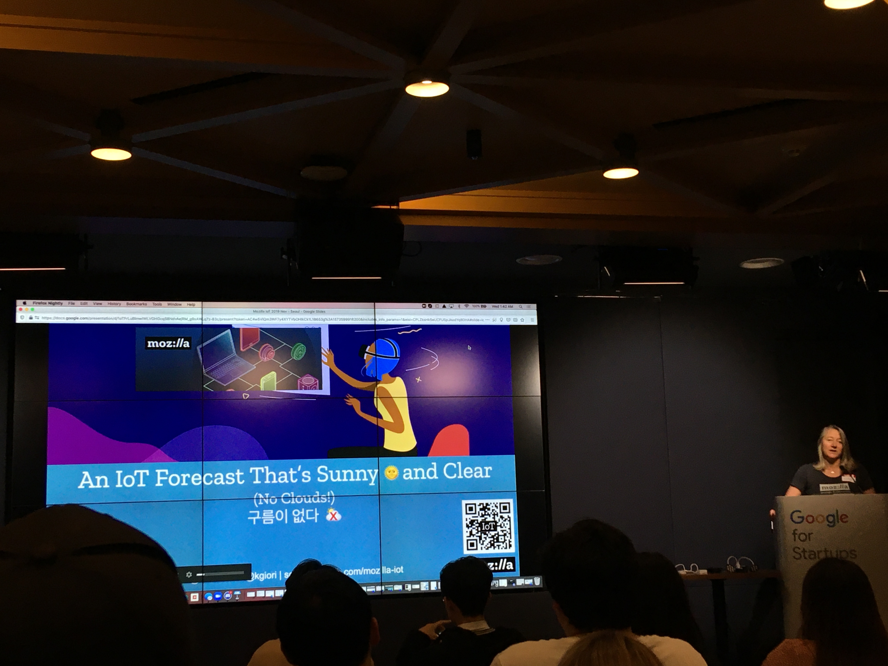
_IoT의 미래는 밝다!_

IoT의 문제점 중 하나는 보안이다.
이를 해결하는 방법으로 Mozilla는 IoT기기에 URL을 부여해서 클라우드(중개자 역할)에서 통신하는 것이 아니라 WebThings Gateway 소프트웨어를 Gateway에 설치해서 IoT기기와 WEB으로 통신하는 방법을 택했다.

또한 IoT는 각기 다른 회사가 모두 다른 통신방법을 사용한다는 점이 문제가 된다. _(그 예로 현재 우리 집에 있는 샤오미 공기 측정기와 Google Home이 연결이 되지 않는다.)_

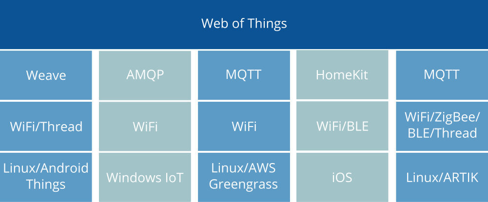

이런 상호 운용성 문제를 여러가지 통신 방법을 지원하여 해결하였다.

WebThings 프레임워크로 자신만의 gateway나 Client(자신만의 컨트롤러)를 만들 수 있다.
그리고 Mozilla WebThings는 오픈소스로 열려있고 누구든지 Contribution이 가능하다.

세션 중간에 미국에 있는 캠과 전등을 연결해서 전등을 키고 끄는 것을 앞에서 시연하였다.
MicroBlock으로 WebThings Framework를 통한 기기를 만들고 그 프로그램을 기기에 옮겨 gateway에 연결하면 컨트롤할 수 있다는 것까지 시연하였다(동영상을 못 찍은게 아쉬움으로 아직도 남아있다.).

## Mixed Reality를 Web에서 구현하기 - WebXR

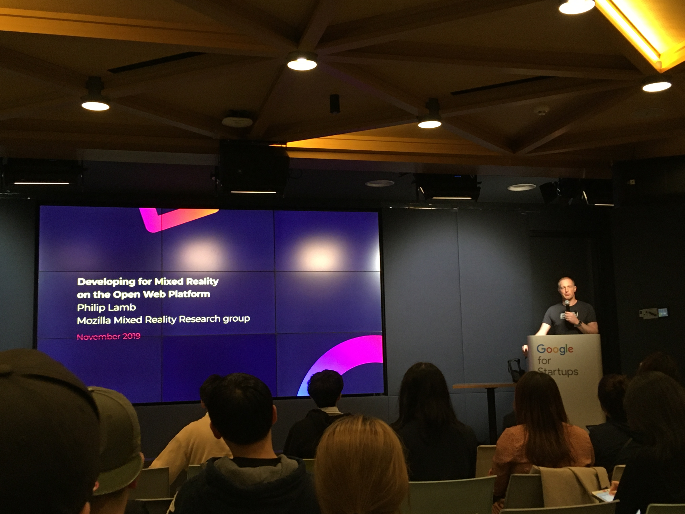

> 빠진 부분이 많아 틀릴수도 있습니다.

Mixed Reality라는 분야를 들어가기 전에 파트중 AR을 택할 것인지, VR을 택할 것인지, VR헤드셋을 택할 것인지 정하게 된다.

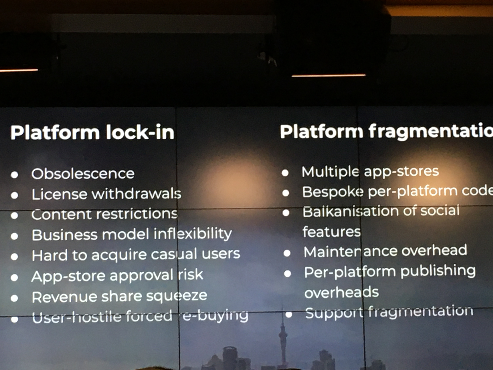
_이렇게 해도 문제, 저렇게 해도 문제가 된다.._

이 이후에도 많은 플랫폼(많고 많은 VR 헤드셋..) 중에 어느 것을 지원할지 정한다. 플랫폼을 고정할 것인지, 다양한 플랫폼을 지원할 지도 문제가 된다.

또 개발환경과 Delivery Mechanism(?)도 정해야한다.

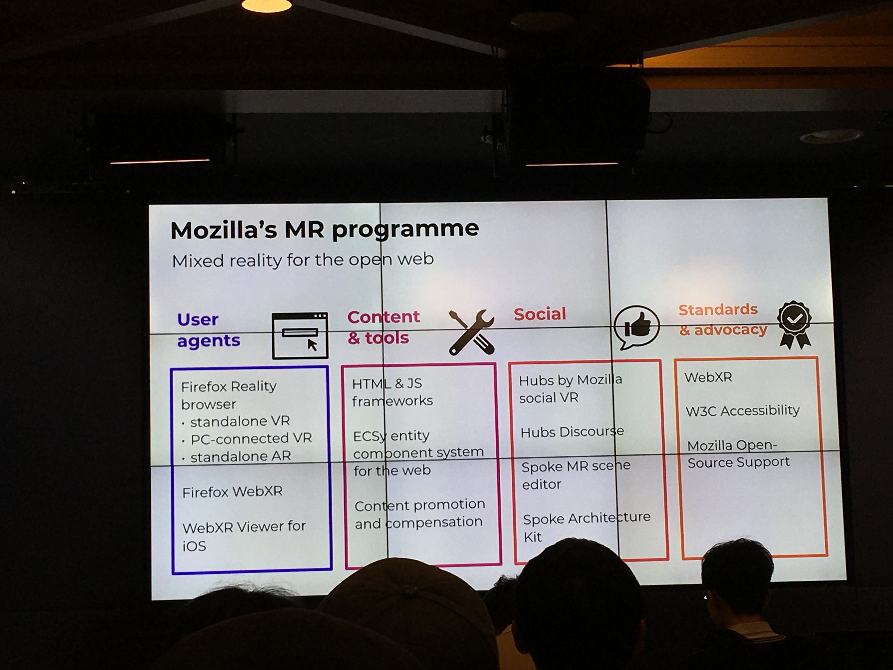
_이를 해결하기 위한 기술들_

### User Agents

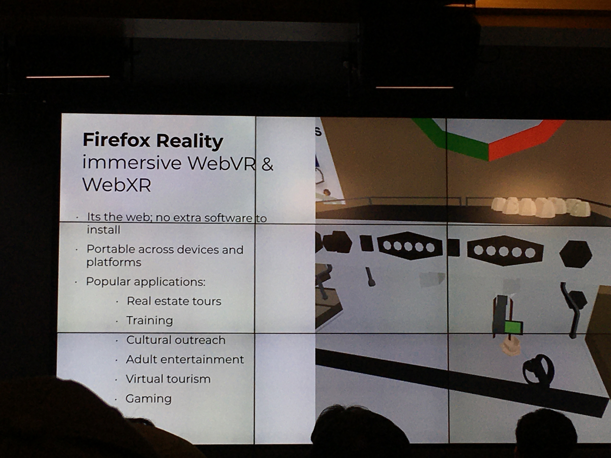

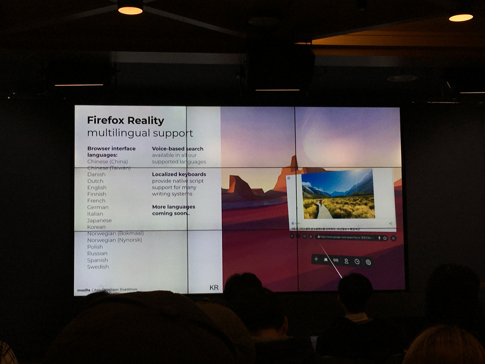
_Web MR은 다른 소프트 웨어가 필요 없고 많은 기기를 지원한다! 또한 웹이기에 많은 언어를 지원한다._

앞에서 WebXR으로 브라우저를 여러개 띄우고, 한국어 자판으로 브라우저에서 검색하는 시연 영상을 보여주었다.

### Contents & tools

많은 MR 어플들이 Unity를 사용 중인데, MR을 개발 하기 위해 Unity를 사용해야할까?

하지만 Flash 사용해야 하는 것이 가로막는다(현재는 WebGL을 지원한다고 한다).

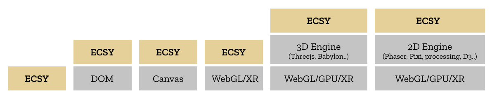
그렇기에 Three.js, D3.js 등 여러 라이브러리나 API 위에서 돌아가는 <a href="https://blog.mozvr.com/introducing-ecsy/" target="_blank">ECSy</a>라는 프레임워크을 만들었다.

### Social

<a href="https://hubs.mozilla.com" target="_blank">hubs.mozilla.org</a>에서 VR로 가상의 방을 만들어 사람들끼리 가상의 방을 만들어 만날 수 있도록 만들어놨다.
컨텐츠를 만들어서 WebXR의 예시를 보여주는 것 같다.

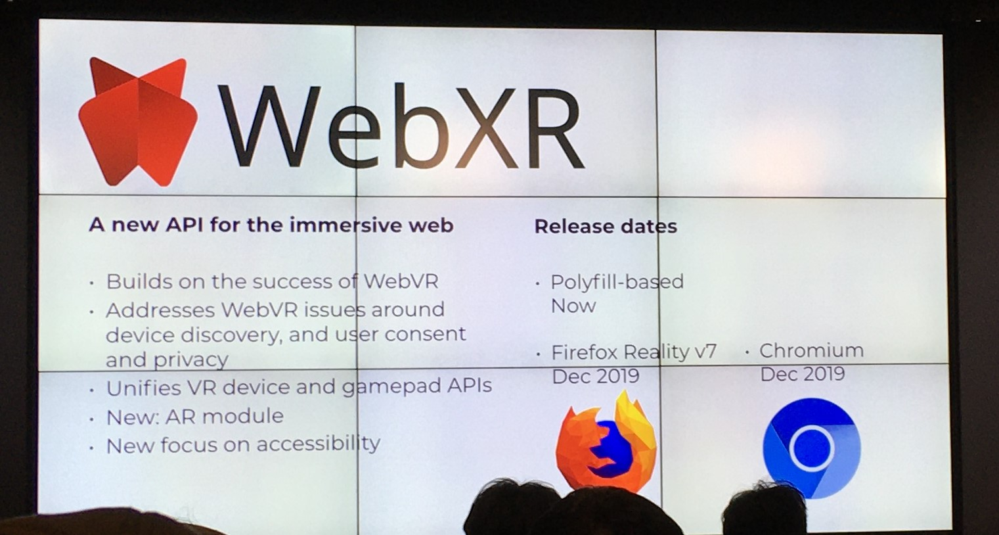
_여러가지 API를 추가할 예정이고 출시도 12월에 예정되어 있다._

WebXR Emulator 확장 프로그램으로 WebXR의 개발자 도구에서 VR 헤드셋과 컨트롤러에 따른 화면을 테스트할 수 있다.

Native 어플리케이션을 따라잡고 실제로 쓰이려면 많은 시간이 걸리겠지만 Web으로 이러한 시도를 한다는 것이 새로웠다.

## 브라우저 파편화에 대한 대응 - WEBCOMPAT

### WEBCOMPAT?

WEBCOMPAT은 웹 호환성을 높이기 위한 프로젝트이다.
웹을 만들 경우 예전 브라우저(ex. IE)나 다른 브라우저를 지원하기 위한 파편화를 막을 수 없다.

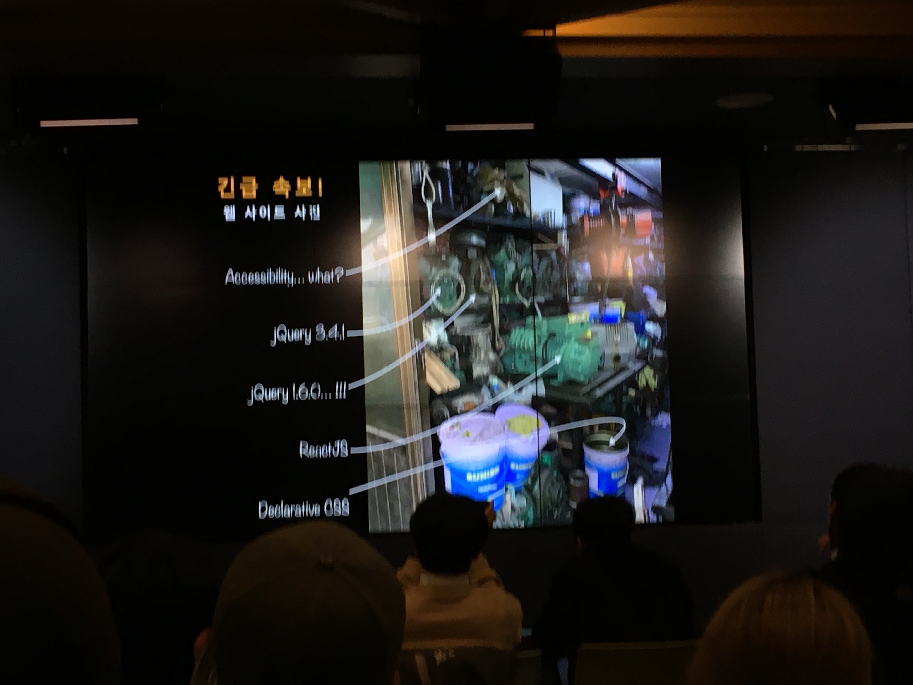
_상상만 해도 끔찍......_

하지만 이를 거의 모두 지원하려 하다보면 위 사진과 같이 의존성 지옥에 빠지고, CSS코드는 매우 복잡하게 될 것이다.
이에 대한 희생은 모두 사용자에게 가게 된다.

이를 방지하기 위해서 [링크](https://webcompat.com/)에서 웹사이트에 대한 문제를 제보할 수 있게 해놓았다.
하지만 이런 문제를 모아서 렌더링/ 버그인지, 렌더링 문제인지 판단하면 다음과 같은 선택지가 주어진다.

- 문제가 있는 웹사이트 책임자에게 연락하여 고치도록 연락한다.
  - 거의 불가능에 가깝다. 그러므로 문제가 있는 웹사이트를 검색하는 검색엔진을 만드는 것이 좋을 것 같다.
- 브라우저를 고친다.
  - 버그라면 고치는 것이 맞지만 단순히 브라우저가 렌더링 하는 방식이 다른 것이라면 한 브라우저가 독점하는 문제가 생긴다.

### FireFox Devtools

Firefox Devtools를 이용하면 CSS를 시각적으로, 또 쉽게 다룰 수 있다.

- Devtool에서 CSS가 적용되지 않는 상황이라면 Devtool에서 왜 적용이 되지 않는지 설명하는 툴팁이 뜬다.
- Devtool에서 시각적으로 CSS 변경을 쉽게 할 수 있다(ex. polygon 값 변경, 글꼴 변경탭).
- 다른 브라우저에서 적용되지 않는 경우 Compatiblity 탭에서 어떤 브라우저에서 작동하는지 볼 수 있고 경고창을 띄운다(<a href="https://addons.mozilla.org/ko/firefox/addon/site-compatibility-tools/?src=search" target="blank">아직 개발중에 있다</a>).

## 새로운 Web Layouts - SubGrid

### Grid

CSS가 발전해왔음에도 불구하고 CSS를 다루기는 매우 힘들다(매우 공감한다).
1차원 레이아웃(정렬이나 공간 배분)을 쉽게 만들기 위한 Flex와 2차원 레이아웃을 쉽게 만들기 위한 Grid가 그 힘듦에 해결책이 되었다.

이 중 Grid의 장점은 행과 열을 사용자 마음대로 나누어서 CSS코드를 더 깔끔하게 짤 수 있다는 점이다.
Grid를 사용하지 않고 만들려면 모두 Width를 지정해줘야 한다.
또한 Grid를 지원하는 브라우저를 93퍼센트 정도의 사용자가 사용하고 있다(7퍼센트도 호환해줘야 하는 웹사이트 개발자들에게 애도를..).

Firefox devtools로 Grid를 시각적으로 쉽게 조정할 수 있다.

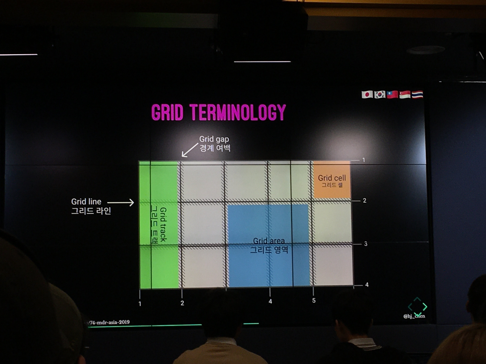
_Grid를 모르는 사람들을 위해 Grid의 간단한 설명을 해주었다._

### SubGrid?
<a href="https://developer.mozilla.org/en-US/docs/Web/CSS/CSS_Grid_Layout/Subgrid" target="_blank">SubGrid</a>는 Grid 안의 한 영역에 또 다른 Grid를 만들 수 있도록 하는 속성값이다.
Grid 안에서 바깥과 다른 새로운 Grid를 설정할 수 있도록 만든 속성값이다.

display grid로 정하고 grid-template-columns이나 grid-template-rows 중 안의 grid를 만들고 싶은 속성에 subgrid 값을 부여해서 Grid 안에서 새로운 Grid를 설정할 수 있게 한다.

현재 subgrid는 Firefox Nightly에서 볼 수 있다.
## 더 나은 Animation을 위한 10가지 

_Animation에는 문제가 많다._

Animation을 직접 다뤄본 적은 없지만 Animation이 문제가 많다는 것을 주제로 시작을 해서 어떻게 해결할 것인가에 대해 재밌게 설명을 해 주셔서 재밌게 들었다.

"저는 W3C CSS Working Group이라는 CSS 표준을 만드는 그룹에 속해 있는데 ~한 문제를 이 그룹에게 '어서 도입하세요!'라고 말한다"라는 말에 많이 웃었다.

### animation-timing-function
<a href="https://developer.mozilla.org/en-US/docs/Web/CSS/animation-timing-function" target="_blank">animation-timing-function</a>에서 step을 사용할 때 뜻대로 되지 않는 경우가 많다.

step(n, <jumpterm\>)에서 n은 마지막을 포함해서 변경하는 숫자를 나타낸다.

&rarr; 그렇다고 개수를 하나 줄이면 마지막 프레임이 보이지 않는다.

&rarr; jumpterm에 start라는 값을 주면 첫번째 프레임이 보이지 않는다(start는 animation이 시작하자마자 첫번째 프레임이 지나가게 하는 속성값).

결국 <a href="https://developer.mozilla.org/en-US/docs/Web/CSS/animation-timing-function" target="_blank">jump-none</a>이라는 값을 만들었지만 현재 Firefox에서만 지원한다.
### animation에는 버그가 많다.
animation 중에 작동하지 않거나 완료되지 않는 경우가 많다. 그래서 transitionrun, transitioncancel, animationcancel.. 속성들을 만들었다.
### Javascript에서 animation을 만드는 것은 어렵다.
- [`Element.animate()`](https://developer.mozilla.org/en-US/docs/Web/API/Element/animate)을 사용한다.

### 전체 애니메이션을 Ease하기 어렵다.
- `Element.animate()`의 인자인 객체에 <a href="https://developer.mozilla.org/en-US/docs/Web/API/EffectTiming/easing" target="_blank">`easing`</a>를 추가한다.

### 애니메이션을 속도로 지정하기 어렵다.
- `Element.getAnimations()`로 애니메이션 객체를 가져와서 조종한다.
- 현재 메이저 버전에는 지원하는 곳이 없다.

### transition의 중간점을 조정하기 어렵다.
- [`CSSTransition.getKeyframes()`](https://developer.mozilla.org/en-US/docs/Web/API/KeyframeEffect/getKeyframes)로 중간점을 조정한다.

### 해당 요소가 경로를 따라가게 하고 싶다.
- [`offset-path`](https://developer.mozilla.org/en-US/docs/Web/CSS/offset-path)로 애니메이션의 이동경로를 정한다.

### animation의 성능을 정확하게 측정하기 어렵다.
- Firefox animation Devtool을 통해 애니메이션이 어떻게 적용되는지 나타내는 그래프나 애니메이션의 성능을 알 수 있다.

### 애니메이션을 보고싶지 않은 사람이 있을 수도 있다.
- 제어판이나 설정에서 애니메이션 표시(windows 10) 속성을 끄거나 Reduce Motion(Mac)을 키면 prefers-reduced-motion이라는 미디어 쿼리로 감지할 수 있다.

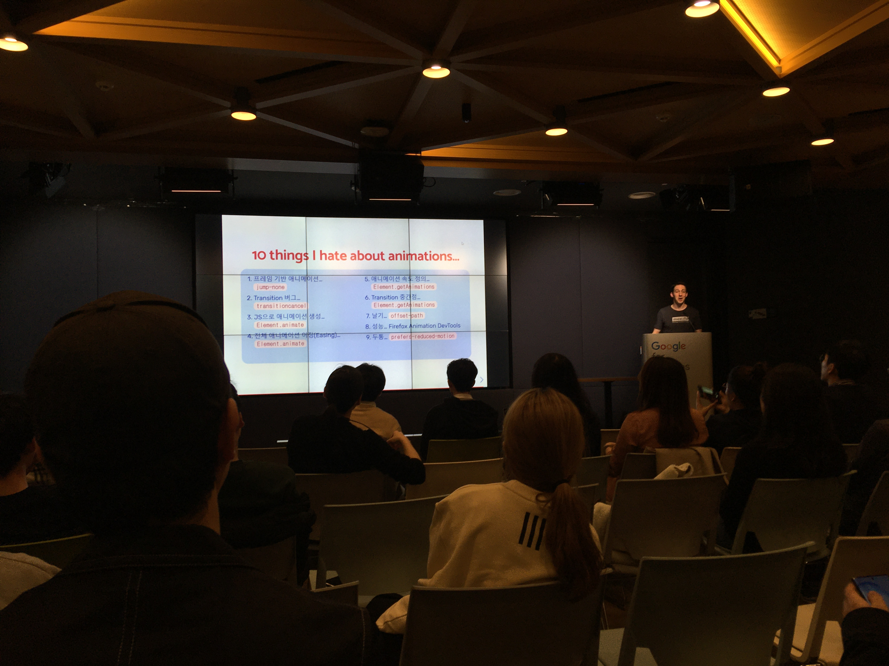

## 마무리
올리는 것은 늦어졌지만 웹을 통해 여러 분야로 나아간다는 것을 실감나게 느꼈다.
다음에는 취미로 건드리는 것도 나쁘지 않아 보인다.