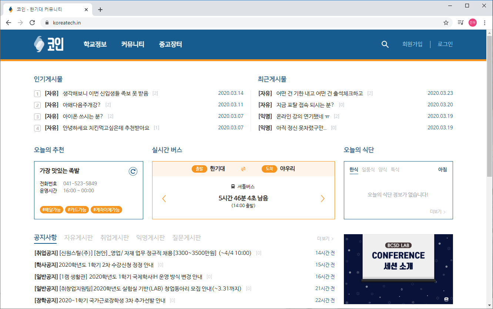
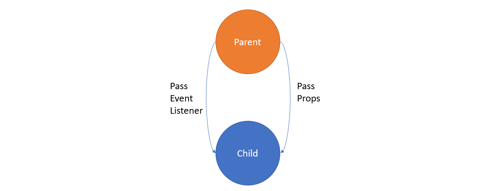
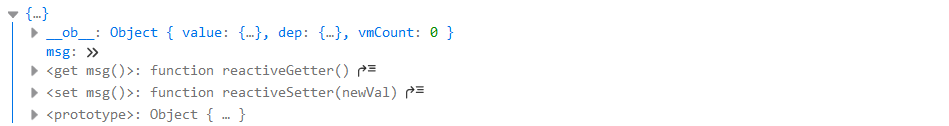

# 들어가며

동아리에서 만든 학생 커뮤니티 서비스 개발에 참가한지도 벌써 1년이 지났다. <del>시간은 참 빨리 가는 것같다.</del>  처음에 커뮤니티 어드민 페이지 개편(이라고 쓰고 퇴화라고 부른다)에 참가했을 때는 처음 개발하는 서비스에 걱정과 두려움을 느끼면서 개발을 시작했는데 홍보게시판 개발에 참여하고 React 마이그레이션, 테스트 작성까지 마치면서 자신감이 붙게 되었다. 테스트 작성을 끝내고 비는 기간동안 KOIN 서비스의 프레임워크를 Vue에서 React로 마이그레이션을 하면서 느낀점이나 배운점을 적고 공유해보려고 한다.


_동아리에서 만든 학생 커뮤니티 서비스 KOIN의 모습_

2019년 방학이 오기 전까지는 서비스의 프론트엔드는 Vue 프레임워크로 개발을 해왔었다. 그러던 와중 시간이 많이 비는 방학동안 프레임워크를 Vue에서 React로 마이그레이션하기로 결정되었다. 하지만 Vue를 배운지 6개월, Vue로 서비스 개발을 시작한지 4개월차인 나는 프론트엔드 프레임워크를 배울 때 어렵다는 React의 위상에 겁을 먹고 있었다.


_Vue를 배우면서 느꼈었던 React_

하지만 React 공식문서의 튜토리얼의 처음 부분을 보고 약간 안심이 되었다.

# Vue와 React는 매우 닮았다.

React 공식문서의 튜토리얼에서도 느끼고, Vue에서 React에서 마이그레이션하면서 느낀 것은 Vue와 React는 많이 닮았다는 것을 느낄 수 있었다. 가장 큰 기능들이라고 볼 수 있는 것들이 닮았으니 매우 비슷하다고 볼 수도 있습니다. 가장 크게 느꼈던 닮은 점 두가지는 다음과 같다.

- Vue에서 배웠던 핵심적인 **Virtual DOM**은 React에서 따온 것이다.
- 재사용가능한 코드를 컴포넌트로 선언하여 HTML 엘리먼트같이 재사용하기 쉽게 만들 수 있다.
- React와 Vue의 컴포넌트 모두 비슷한 라이프 사이클을 가진다.

이 외에도 직접 떠오르진 않았지만 많은 부분이 비슷해서 수월하게 배우고 적용할 수 있었다.

# 하지만..

세부적으로 들어가면 기능과 코드를 짜는 스타일도 모두 다르다.  간단한 예제와 함께 차이점을 알아보도록 하자. 밑의 코드는 사용자 정의 input 컴포넌트와 그의 결과를 보여주는 화면을 만든 것이다.

```vue{codeTitle: "CustomInput.vue"}
<template>
  <input
    :value="message"
    @change="changeMessage($event)" />
</template>

<script>
export default {
  name: 'CustomInput',
  props: {
    message: String,
  },
  methods: {
    changeMessage(e) {
  	  this.$emit('change', e.target.value)
    },
  },
}
</script>
```


```vue{codeTitle: "Home.vue"}
<template>
  <div>
    <custom-input
      :message="msg"
      @change="value => {msg = value}" />
    {{ msg }}
  </div>
</template>

<script>
import CustomInput from '../components/CustomInput.vue'

export default {
  name: 'Home',
  components: {
    'custom-input': CustomInput
  },
  data() {
    return {
      msg: '',
    };
  },
}
</script>
```
_간단하게  Vue로 작성한 input 컴포넌트와 보여주는 화면_

```jsx{codeTitle: "CustomInput.js"}
import React from 'react';

export default function CustomInput({
  message,
  onChangeMessage
}) {
  return (
    <input
      value={message}
      onChange={e => onChangeMessage(e.target.value)} />
  )
}
```

```jsx{codeTitle:"Home.js"}
import React, {useState} from 'react';
import CustomInput from '../components/CustomInput';

export default function Home() {
	const [msg, setMsg] = useState('');
  return (
    <div>
      <CustomInput
        message={msg}
        onChangeMessage={setMsg} />
      {msg}
    </div>
}
```
_간단하게  React로 작성한 input 컴포넌트와 보여주는 화면_

## 컴포넌트간 통신

크게 보면 위의 코드 스타일이 다른 이유가 컴포넌트간 통신을 하는 방법이 다르기 때문이라고 생각한다. Vue에서 React로 마이그레이션하면서 가장 많이 바뀐 것과 가장 어려워 했던 것이 `props`와 `state`를 관리하는 방법이다.

Vue에서는 `props`와 `event`를 이용한 양방향 데이터 바인딩을 한다. `props`로 자식 컴포넌트에게 데이터를 전달하고 `custom event`로 부모 컴포넌트에게 데이터와 함께 보내서 부모 컴포넌트에서 그 데이터를 다루는 함수를 자식 컴포넌트의 event에 구독한다.


_Vue 공식 가이드에 있는 컴포넌트간 통신 모형_

```vue{codeTitle: "CustomInput.vue"}{10-12,15}
<template>
  <input
    :value="message"
    @change="changeMessage($event)" />
</template>

<script>
export default {
  name: 'CustomInput',
  props: {
    message: String,
  },
  methods: {
    changeMessage(e) {
  	  this.$emit('change', e.target.value)
    },
  },
}
</script>
```
_props로 부모컴포넌트에게서 데이터를 받고 $emit으로 event를 생성한다._

이 방식은 코드를 짤 때에는 쉽지만 후에 유지보수를 하게 되면 데이터를 저장하는 위치와 어떻게 `event`가 발생하는지 파악하기 힘들어진다. Vue의 공식문서에서는 따로 주의를 하지 않았지만 유지보수와 후에 확장성을 생각하면 `state`를 어디에 위치해야 할 지와 어떻게 `event`를 발생하는 `$emit`을 줄일지 고민한 뒤에 코드를 짜는 것이 좋아보인다. 아니면 후에 고통을 받으면서 개발을 하게 될 것이다.

React는 `props`로만 통신하는 단방향 데이터 바인딩을 한다. React에서는 `event`가 없으므로 데이터와 그 데이터를 바꾸는 함수를 모두 자식 컴포넌트에게 전달하고 자식컴포넌트는 그를 이용하는 식으로 데이터를 다룬다. React의 단방향 데이터 바인딩은 다음에 기술할 반응형 시스템과 합쳐져서 후에 분석하기 좋은 코드를 만들도록 유도한다.


_굳이 표현하자면 이런 모형_

```jsx{codeTitle: "CustomInput.js"}{4-5,9-10}
import React from 'react';

export default function CustomInput({
  message,
  onChangeMessage
}) {
  return (
    <input
      value={message}
      onChange={e => onChangeMessage(e.target.value)} />
  )
}
```
_props로 부모컴포넌트에게서 데이터와 함수를 받아 HTML 요소의 이벤트에 구독한다._

Vue에서도 [단방향 데이터 바인딩](https://kr.vuejs.org/v2/guide/components.html#%EB%8B%A8%EB%B0%A9%ED%96%A5-%EB%8D%B0%EC%9D%B4%ED%84%B0-%ED%9D%90%EB%A6%84)을 지원하지만... 이는 단순하게 자식 컴포넌트의 데이터를 초기화하거나 `computed` 속성을 위한 것이다.

## 반응형 시스템

Vue와 React를 데이터를 다루는 데에 차이가 있는 이유 중 가장 큰 것이 반응형 시스템의 차이때문이라고 생각한다. 그리고 마이그레이션할 때 가장 애 먹었던 것도 반응형 시스템의 차이 때문이였다.. ㅠㅠ

Vue에서는 [공식문서](https://kr.vuejs.org/v2/guide/reactivity.html)에도 말했듯이 `watcher`가 데이터가 변경되었을 때 재렌더링을 담당하는데, Vue 컴포넌트 안에 `observer`를 넣어 `data` 객체가 바뀌는 것을 관찰해서 `watcher`에게 전달하여 재렌더링을 하게 된다. 또한 참조형 변수는 참조형 변수 안의 값을 바꿨을 경우 주소가 변경되지 않으므로 data 안의 모든 참조형 변수 안에도 `observer`가 들어가 있다.


_Vue를 개발하게 되면 많이 볼 observer_

처음 공식문서로 공부를 하고 개발에 들어갔을 때 가장 당황했던게 이 시스템이였다. 전역 상태에서 객체로 된 배열을 컴포넌트로 가져와서 상태를 바꿨는데 전역 상태까지 바뀌어서 당황했던 기억이 아직도 생생하다. 그래서 이 문제는 `JSON.parse(JSON.stringify(...))`으로 관찰을 끊어서 복사본을 얻을 수 있다.

이 시스템의 장점이라면 유연함을 들 수 있겠다. `vuex`의 real-world example을 보면 `axios`로 서버에서 받은 데이터를 `computed`로 받아와서 컴포넌트에서 `vuex`의 상태를 바로 변경하는 모습을 볼 수 있다. 하지만 이러한 유연함때문에 코드 분석이 어려워진다는 단점이 같이 따라온다.

React는 Vue와 다르게 상태를 바로 수정하는 행위를 막아놓고, 함수로만 바꾸도록 만들어놨다.  그리고 React 내부에서 불변성을 판단하여 재렌더링을 한다. 여기서는 불변성을 기준으로 재렌더링을 하기 때문에 참조형 변수는 깊은 복사를 하면 재렌더링이 된다. 불변성을 중심으로 코드를 짜면 코드가 분석하기 쉬워진다.

## 코드 스타일?

막말로 Vue에서는 많은 것을 신경쓰지 않고도 생각한대로 만들면 돌아갔다.  물론 되는대로 짜서 나오는 안티패턴이나 에러를 방지하고자 [스타일 가이드](https://kr.vuejs.org/v2/style-guide/index.html)라는 것으로 코드 스타일을 규칙에 따라 짜게 한다. 하지만 대부분 세세한 스타일이기 때문에(`computed`속성에서 `data`를 바꾸지 말라는 것) 되는대로 짜면서 발생하는 모든 안티패턴을 방지하진 못한다. 그래서인지 처음 프로젝트에 들어갈 때(물론 실력 부족 문제도 있겠지만) 분석에 어려움을 느꼈다.

그에 반해 React는 [React처럼 생각하고 코드를 짜는 것](https://ko.reactjs.org/docs/thinking-in-react.html)을 명시하고 있고 여기에는 `ProductCategory`를 만들면서 `props`와 `state`를 어디에 배치시켜야 하는지 가이드하고 있다. 이는 `props`와 `state`를 어디에 둘지 고민하게 만들고, 후에 분석할 때를 대비해 분석하기 쉽게 합니다. 물론 lint로 막고있지 않아서 분석하기 어려울 수도 있다(그럴 일이 없도록 대비해야 하겠지만). 이외에도 Airbnb에서 만든 [스타일 가이드](https://airbnb.io/javascript/react/)도 존재한다고 합니다. 오래됐지만..

## 이외에도..

- React에서는 이벤트 바인딩을 할 때 함수를 넘겨줘야 하지만 Vue에서는 HTML 바인딩같이 함수 실행 코드(ex. onClick())를 넘겨주어도 잘 작동합니다.
- Vue는 애니메이션이나 props의 type check가 포함되어 있지만 React는 분리되어있다.
- Vue에는 slot이라는 기능으로 children을 분배할 수 있지만 React는 그냥 props로 넘겨야 한다.
- .....

# 끝마치며

React를 공부하면서 역시 React가 Vue보다 생태계가 넓다는 것을 느꼈다. Vue보다 오래된 라이브러리인 만큼 레거시인 자료도 있지만 역시 React가 Vue보다 자료가 많다. 그리고 React Hooks가 생기면서 코드가 복잡해진다는 단점도 사라지면서 매우 매력적인 프레임워크가 된 것 같다. Vue 또한 3.0이 되면서 composition API가 생기면서 쉽고 빠르게 배울 수 있는 프레임워크로 매력적인 것 같다.

또한 이 포스팅을 위해 조사하면서 내 실력이 부족함을 느꼈다. 부족함을 느끼면서 포스팅을 마치겠다.

> 출처
>
> [Vue 공식문서](https://vuejs.org/v2/guide/)
>
> [React 공식문서](https://ko.reactjs.org/docs/hello-world.html)
>
> [React와 Immutable](https://velopert.com/3486)
>
> [Vue observer과 watcher](https://beomy.github.io/tech/vuejs/reactive-observer-dep-watcher/)