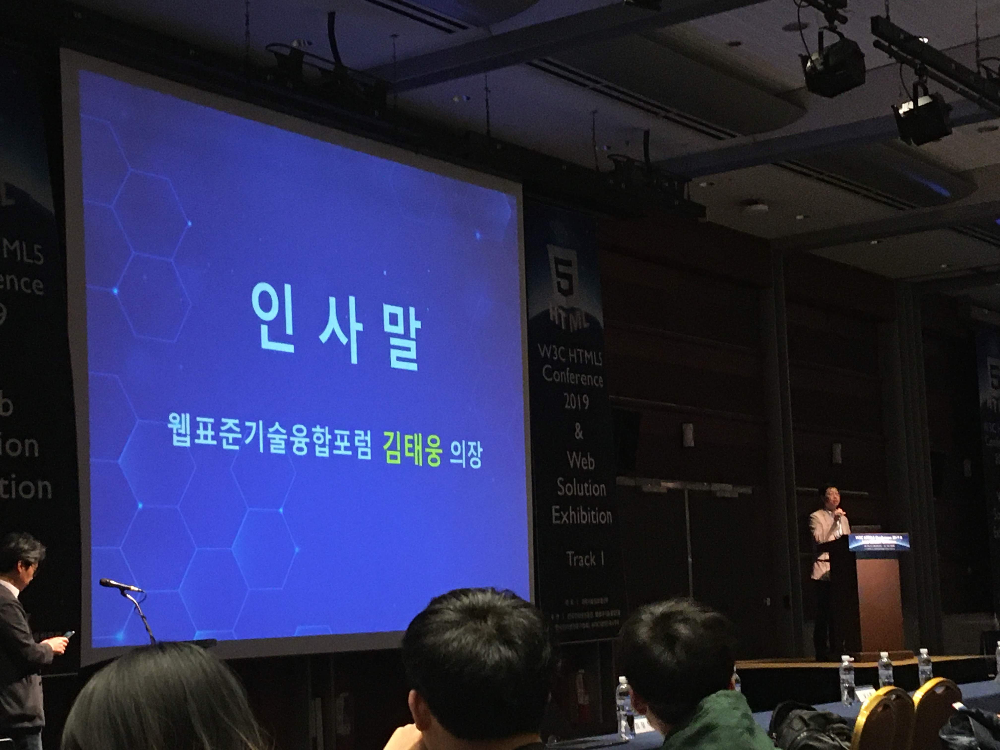
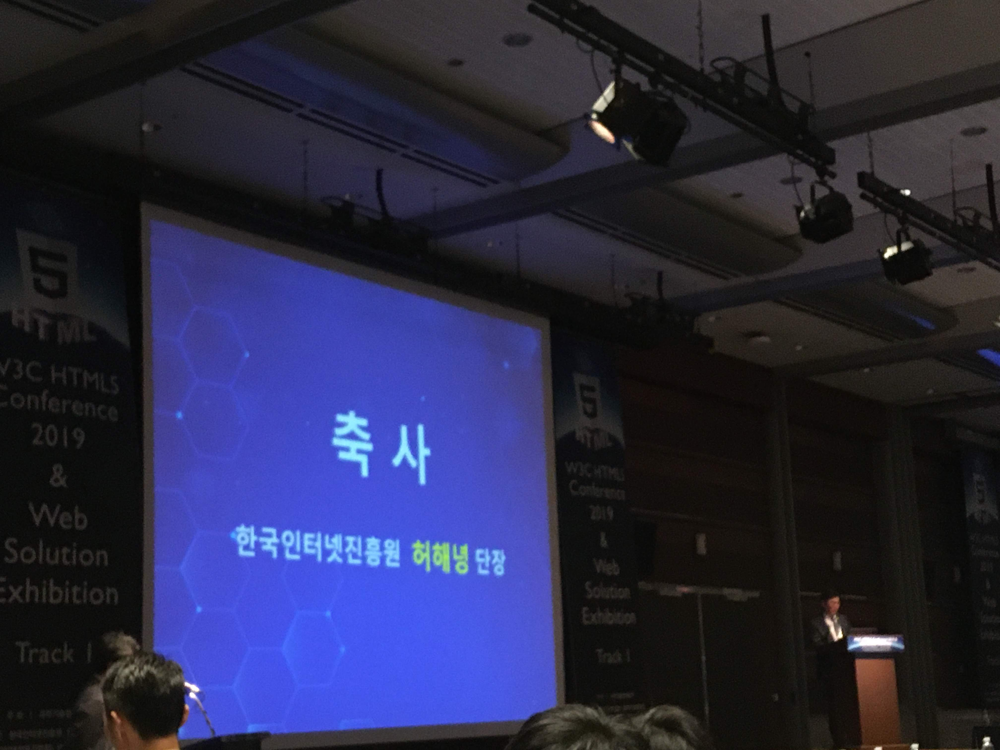
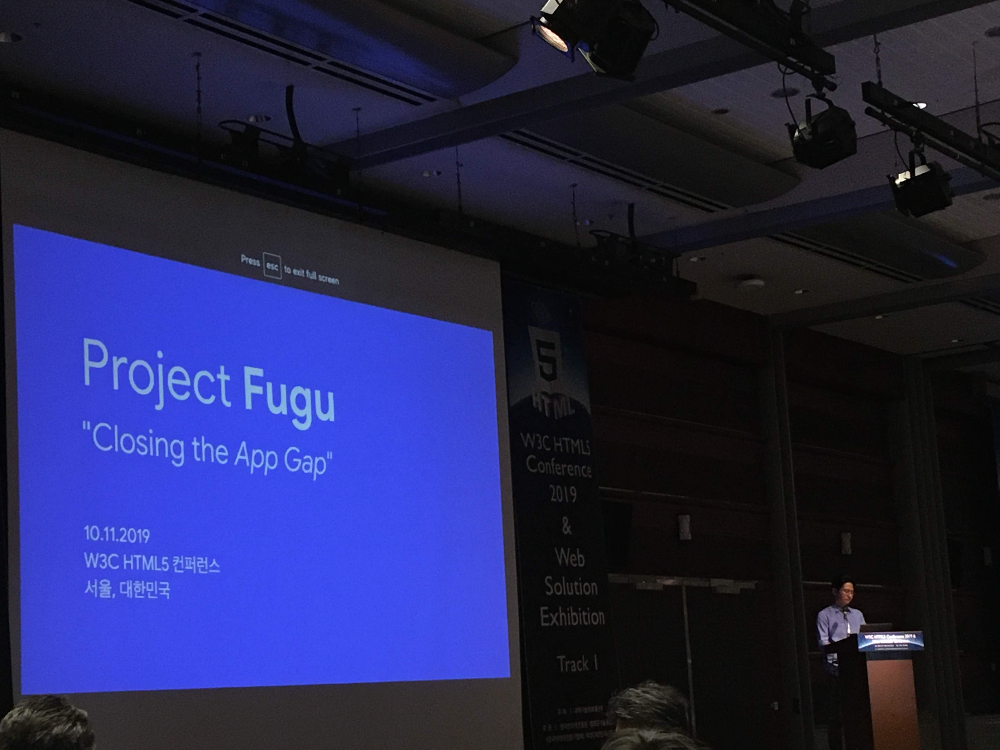
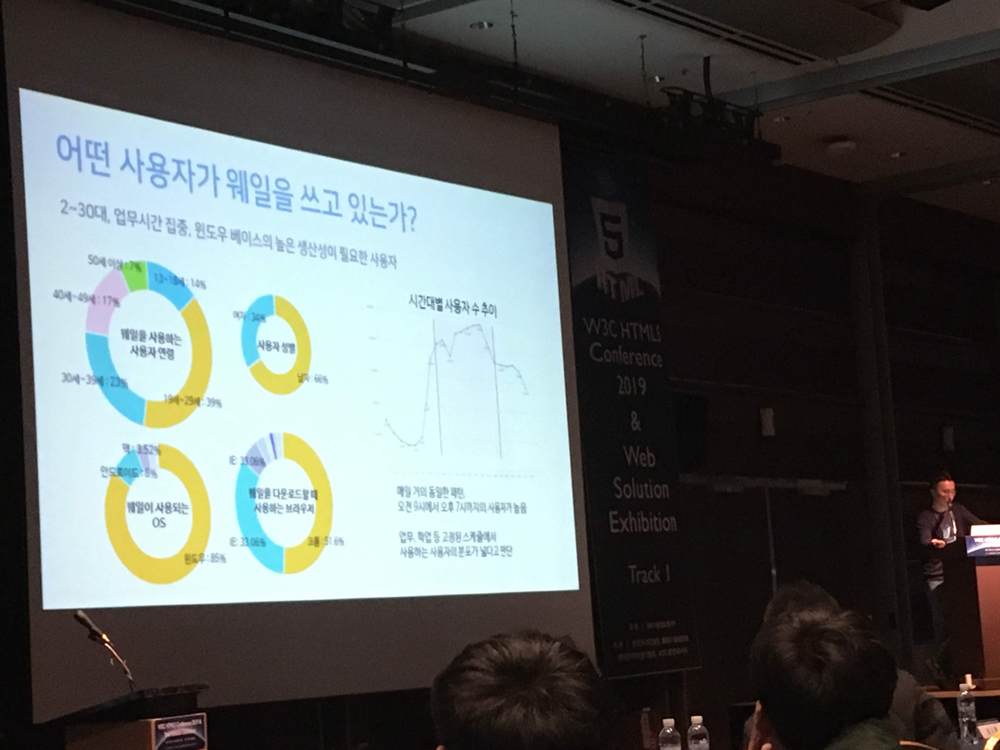
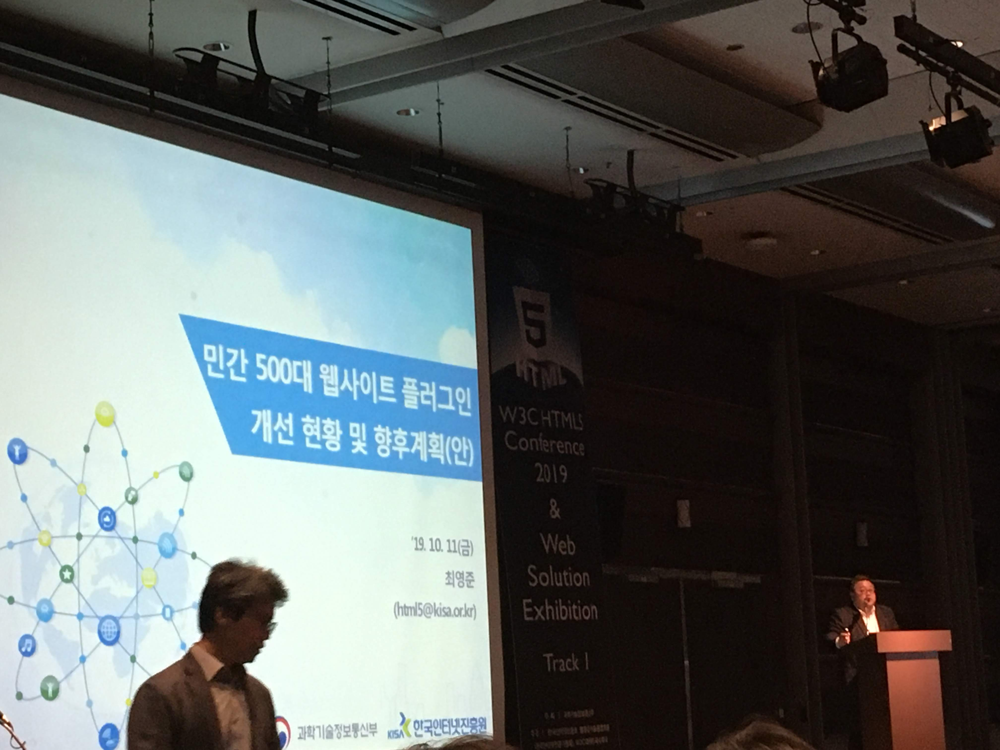

## 들어가며

 10월 11일 금요일에 코엑스 그랜드 볼룸에서 열린 W3C HTML5 Conference 2019에 다녀왔다. 아버지 따라서 건축 박람회는 많이 가봤지만 내 스스로 신청해서 가본 컨퍼런스는 처음이었고 프로그래밍 실력이 아직 낮기 때문에 알아듣지 못하는게 많지 않을까라는 생각을 안고 갔다.

_인사말과 축사는 빠르게 지나갔다._

 아래 내용은 키노트와 세션을 들으면서 적은 느낀점과 세부 내용들이다. 듣고 이해하며 타자치는 멀티태스킹은 못 하기에 아래 내용은 실제 발표내용과 어긋날 수 있다.

모든 발표자료는 [여기](https://www.koreahtml5.kr/front/techExper/techExperList.do?bbsId=BBS_00000000001)에서 확인할 수 있다. 발표영상은 [유튜브에 치면](https://www.youtube.com/results?search_query=2019+HTML5+conference) 볼 수 있다.

## Keynote 1: Project Fugu(Google - 최홍찬)

#### 다양한 Web API가 Native 수준으로 올라왔다는 것을 알 수 있게된 시간이였다.

아직 Vue밖에 모르는 주니어 개발자로서 여러 Web API가 있다는 것을 처음 알았을 뿐더러 공부를 열심히 해야겠다는 생각이 다시 한 번 깨닫게 해주었다...
오픈소스를 만드는데에 관심이 있던 나에게 크게 다가왔던 키노트였다 :)

### 세부 내용
#### 소개

- Chromium Web Audio API Owner / Spec Editor

#### 웹의 패러다임
- 정적인 문서를 어플리케이션을 만들음
- 미디어를 만들고 소비하는 어플리케이션으로 쓰임

#### Project Fugu?
- Soundation?
    - 녹음, 음성 편집, 믹싱 등을 하는 것
    - 2010년에는 Flash로 시작됨 -> Flash 지원 중단
    - 웹에서 Native Client에서 C++을 쓸 수 있게 되면서 PNaCl을 만들어 Soundation을 구현함 -> 하지만 웹 브라우저 다양성을 포기해야해서 적용을 포기함 (웹 브라우저가 다양해 다른 브라우저에서 적용이 안 됨)
    - HTML5에 WebAssembly등을 적용해 성공적으로 적용됨
    - **이 프로젝트 완성이 8년동안 끌리는 이유는 웹 표준화의 느린 속도.**
- Spotify
    - 이전에는 앱을 설치하도록 함 -> 사용자의 거부감
    - PWA를 사용해 노래 한 곡을 무료로 재생할 수 있도록 함
    - Desktop App도 PWA로 만들 수는 있지만 프레임워크를 따라가고 기능을 넣어야 하기 때문에 장벽이 존재함.
    - **이 이유는 웹에는 필요한 기능(ex. 오프라인 재생, 무제한 저장소)이 없기 때문.**
- Web Audio API
    - 2010년부터 이 기능이 있었고, 4퍼센트정도의 페이지가 이 API를 쓰지만 업계에 적용하고 성공한 사례는 손에 꼽을 정도.
    - **이 이유는 개발자가 원하는 기능을 만들 수 있게 하는 API의 확장성의 부족.**
    - 선순환이 계속되면서 생태계가 성장할 수 있도록 해야 한다.
- 미션
    - 웹 플랫폼과 Native의 기능 차이를 줄인다.
        - 많은 기능들을 만들려고 하고 모두 Tracking하고 있다.
       - 개발자(파트너) 의견 수렴 -> 의견을 받아 캐주얼한 문서 작성 -> 폭넓은 의견 수렴 -> 스펙 문서 작성 -> 기능 출시

       - 익스플레이너
           - 문제점의 분명한 정의 / 문제의 접근 방법과 해결책의 제안 / 해결책에 제안된 디자인에 기반한 코드 예제 작성
       - 오리진 트라이얼
           - 새 웹 기능을 안전하게 실험
           - 새 기능을 사용한 앱으로 유저들이 테스트 가능
           - 의미있는 피드백을 받을 수 있음
    - 웹의 장점을 보존
        - 권한/허가 - 개인정보 보호 - 보안을 지키지 못하면 안 된다. (Flash의 사례)
    - 이를 통해 개발자들이 웹에서 새로운 경험을 하도록 한다.

#### 현재의 주목받을만한 기능들
- Web Bluetooth
- Web Share & Share Target
- Media Session API
- Shape Detection API
- Badging API
- Native File System
- Web Serial API
- Web HID API

#### QnA
- 브라우저 다양성을 어떻게 해결할 것인가 / 보안을 어떻게 해결할 것인가
    - 브라우저 API를 만들 때부터 Mozilia와 대화를 한다. 그리고 개발자와 소통을 하며 해결을 한다.
- 딥러닝과의 접목을 어떻게 생각하느냐
    - 딥러닝/머신러닝을 웹과 연결해서 개발하는 팀이 있지만 내가 관련되어있지 않아 내가 대답하기는 어려울 것 같다.

## Keynote 2: Move WebFoward (네이버 - 김효)

#### 오늘도 웨일을 사용하는 나에게 웨일의 상황을 자세하게 알 수 있었다.
웨일을 사용하는 입장에서 아직도 발생하는 버그(...) 때문에 불편함을 감수하고 썼지만 어떻게 만들어지는지와 무엇을 걱정하고 발전해나가고 있는지 알게되었던 키노트였다.
웨일이 국내에서 2퍼센트 이용률을 기록하고 있는데 더 발전했으면..ㅎ

#### 지금까지의 웨일
- 2016년 말에 Whale 출시를 발표
- 2017년 3월 베타버전 발표
- 2017년 웨일 1.0 발표
- 2018년 4월 모바일 발표

#### 사용자 분포
- 

#### 기능
- Clean Web(Adblock)
   - 많은 사람들의 요청(하지만 네이버는 광고로 매출을 받는다...)
   - 광고 차단현황
       - Coalition for Better Ads(더 나은 광고를 만들겠다.) - 구글 페이스북 등
       - AcceptableAds (선택적인 광고 수용) - AdblockPlus
   - 그래서 Coalition for Better Ads가 맞다고 생각해서 CBA에 가입하고 표준을 위반하는 광고를 담은 사이트 필터링하고 위배되는 사이트에 포함된 광고를 차단하고 적용한다.
   - 광고 차단 프로세스
       - 1차 필터
            - Naver + CBA + Google의 필터 데이터를 합쳐서 필터링을 한다.
       - 2차 필터
            - 매우 많아서 시간이 많이 걸림.
            - 필터링 방법
                - 모든 룰과 모든 요청을 비교해 실용적인 필터로 필터링을 한다.
                - javascript 기반 차단
        - 필터링 종류
            - Element Blocking : 광고를 가져오지만 보여주지 않음
            - Request Blocking : 광고를 가져오는 요청을 막음(이 형태로 필터링을 하고 있음)
   - 더 해야할 것들
        - Element hiding & re-layout
        - 광고 차단으로 인한 컨텐츠 문제
        - 차단되지 않는 광고 처리
        - ML을 통한 2차필터 업데이트 및 사이트 평가
- 웹 인증서 2.0
    - 공인인증서를 없애기 위해 만듦
    - 빠른 적용을 위해 웹 인증서 1.0을 만듦
       - 보안 문제점이 있음
       - Javascript단에서 처리하는 프로세스가 많음.
    - 2.0에서 개선한 점
       - API 간소화
       - 보안 요소 강화
       - 웹 인증서 API 표준화를 제안함
- Opensource(Chromium) Rebase
    - 기능을 가져와서 품질을 올리기 위해 Rebase를 해야한다.
    - 방식
        - 초도버전 Rebase(한 명이) -> 각 모듈 담당자가 Refactoring과 다시 Rebase -> QA와 안정화
    - Rebase 기간이 줄어들면서 목표한 기간에 가까워지고 있음
    - 목표로 하는 것
        - Rebase 한 번에 모든 플랫폼에 적용되도록 하기
- 웨일2.0의 목표
    - Deview에서 자세하게 발표를 할 것이다.
    - Desktop 주요 컨셉
        - 인스턴트 사이드 패널
        - 웹앱
        - 사이드바 확장앱
   - Mobile 주요 컨셉
        - 듀얼스크린에서 웨일 스페이스를 두 개로 띄울 수 있도록 함
        - 듀얼 검색
        - 스마트 스페이스(추가적인 정보를 서브 스크린에서 전달)
- 웨일을 만드는 이유는 한국에게 맞는 브라우저를 만들기 위함.

## Keynote 3: 민간 500대 웹사이트 플러그인 개선 현황 및 향후 계획(KISA -최영준)

#### 과거 짜증나던 ActiveX의 근황.
옛날에 부모님의 은행 업무나 결제를 하려고 할 때 설치하고 업데이트해야 하는 ActiveX가 매우 귀찮았던 기억이 강하다. 요즘에 스마트폰이 생기면서 볼 일이 없어졌는데 그에 대한 근황을 알게 되었다.

#### 플러그인(Active-X) 사용 현황

- 웹사이트에서 Active-X를 폐지하도록 함
- ActiveX -> 실행파일로 대체를 도입하게 함

#### 플러그인 개선 방향

- 웹 표준 솔루션으로 대체
- 웹 사이트에게 협력을 요청하고 있음

#### 플래시 사용 현황

- Flash
    - 컨텐츠 이용을 위해 설치하는 프로그램
    - 2020년도에 이용이 중단될 예정
- 여전히 많은 웹사이트(40% 정도)가 Flash를 사용하고 있다.
- Flash의 문제점
    - 플래시 설정 방법이 브라우저별로 다름
    - 보안 취약점이 있음(가장 중요)

#### 동향

- 웹브라우저는 모두 지원 중단을 발표함

- 현재 웹 표준 기술(HTML5)로 대체 하고 있음

- 이제 플래시 컨텐츠를 웹사이트에 적용하고 피해가 발생하면 운영자와 제휴사에 책임이 감.

- 정부에서 웹서비스 운영자 / 이용자 대상으로 지원을 함

## Track 11: React, Vue 대신 Svelte (당근마켓 - 변규현)

#### Vue보다 간단한 프레임워크..?
Vue를 배운지 얼마 지나지 않았는데 벌써 새로 떠오르는 프레임 워크가 있다는 것이 신기했다. 하지만 다른 프레임워크/라이브러리를 제치고 인기가 많아질지는 모르겠다.
#### Svelte의 특징

- 코드를 적게 써서 쉽게 이해할 수 있는 코드를 짤 수 있다.
    - React / Vue는 topnav component가 필요하다.(React - <>, Vue - template 태그)
    - 하지만 Svelte는 html 쓰듯이 쓰면 된다.
- React만의 문법, React에 종속된 문법을 공부해야 한다.
  
    - Svelte는 Javascript만 공부하면 된다.
- NO Virtual DOM
    - Virtual DOM은 DOM보다 빠르다..?
        - React는 개발의 편의를 봐주고 DOM 조작 성능의 최소를 보장해줌.
        - Virtual DOM은 충분히 빠르다. 하지만 React의 성능이 느려질 수 있는데 그것을 보완하기 위해 라이브러리를 만들었다.
    - Diffing
        - 트리를 타고 가면서 컴포넌트를 비교
        - 복잡한 UI일 경우 성능이 느려짐
    - Svelte에서는?
        - BUILD TIME에 실행됨. -> DOM을 직접 바꾼다.
        - 메모리 사용량이 적음.

- 문법은 어렵지 않다.

#### 현재 Svelte는

- Embedded Web과 모바일 Web에 최적화되있다고 한다.

- 아직은 생태계 구축이 덜 되어 있다고 한다.
    - SAPPER: 서버사이드 렌더링
    - SVELTE NAVTIVE
    - SVELTE GL

## Track 12 - Vue.js 입문자의 주의점 (KossLab - 장기효)

#### Vue밖에 모르는 입문자의 입장으로서 가장 얻을 것이 많은 세션이였다.
Vue밖에 모르는 내가 와서 주의해야 할 점을 다시 상기한 것이 좋았다. 물론 Vue는 공식문서가 좋아 많은 부분이 공식 문서에 있지만 주의할 점은 보통 보고 넘기기에 한 번 상기하게 하는 계기가 되었다.
#### 반응성

- 과정 : 데이터 변화 -> 재렌더링
- 인스턴스 생성 시 data에서 return되는 속성들 초기화
- 생성 시점에 없었던 data는 반응하지 않는다.
    - 화면에서만 다루는 데이터 생성
    - BE에서 가져온 데이터 추가
        - $set을 활용
    - vuex의 state도 같음

#### DOM 조작

- querySeletor(DOM 선택자) 말고 ref 속성 활용하기.
- 데이터 bind / on / v-for 등 활용

#### 라이프사이클

- Vue instance의 생성하고나서 부터 소멸하기까지의 주기
- Vue의 template
    - 실제 DOM 요소가 아니라 Virtual DOM
- mounted에 DOM이 생성한 이후이기때문에 이전까지는 DOM에 접근하지 못한다.

#### ref 속성

- DOM 요소나 하위 컴포넌트를 가리키기 위한 속성
- template -> render로 바뀐 이후 접근 가능하다.
- 그래서 mounted이후부터 접근 가능하다.
- 주의
    - v-if와 사용하는 경우 해당 영역 렌더링되기 전까지 접근 불가하다.
    - 하위 컴포넌트의 메소드를 호출할 수 있지만 하지 않는 것이 좋다.

- computed 속성

## Track 12: 개발자가 창업할때 유의해야 할 세가지

#### 개발자가 창업을 한다면..?
개발자가 창업을 한다면 어떻게 하게 될까가 궁금해서 들은세션이다. 세션을 듣는 동안 즐거웠던 기억이 난다.
#### 기술 중심의 피벗

- 기술 적용 분야의 고객과 시장을 매번 다시 학습함. + 기술에 대한 애착이 생김
- 고객 중심으로 하면 고객과 시장에 대한 이해가 누적됨.

#### 복잡한 사업 모델

- 사업 검증에 걸리는 시간이 고객이 많아질수록 길어진다.

#### 장인 정신

- 장인정신보다 이 사업에 참여하는 의미를 중요하게 생각하고 사업을 빠르게 검증해야 한다.

- 가장 중요한 것은 다른 창업가의 조언을 주기적으로 받기

## 마치며

 정리한 내용이 HTML5 컨퍼런스 2019에 가지 않은 사람에게 도움이 되었으면 한다. 

 프로그래밍 실력이 좋지가 않아 중간에 집에 갔지만 얻어가는 것이 많은 컨퍼런스였다. 내년에도 열린다면 다시 가고 싶다.