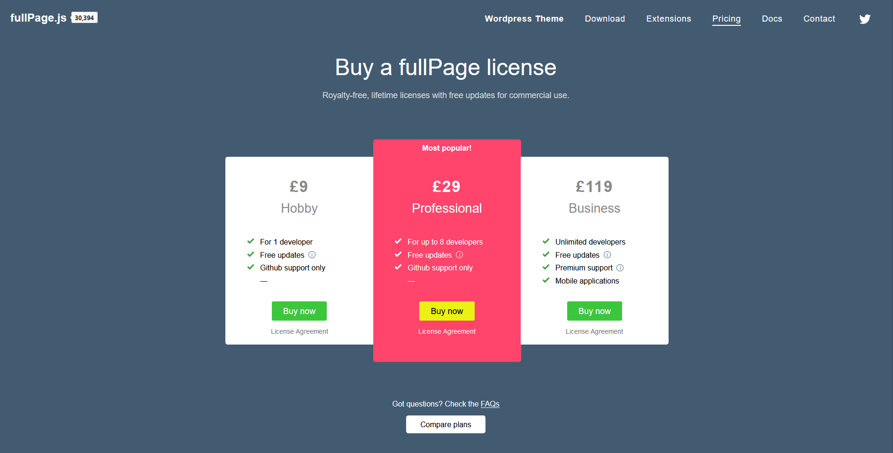
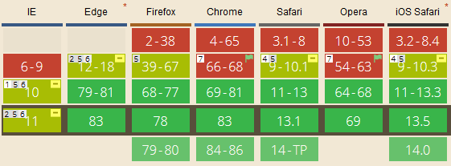
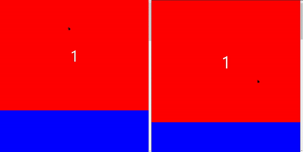
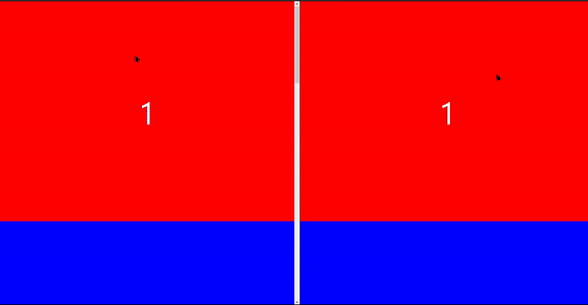
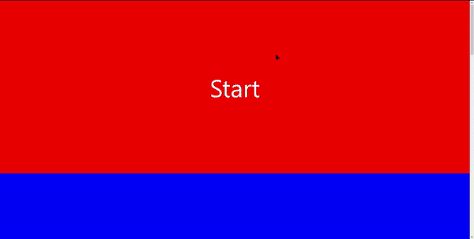
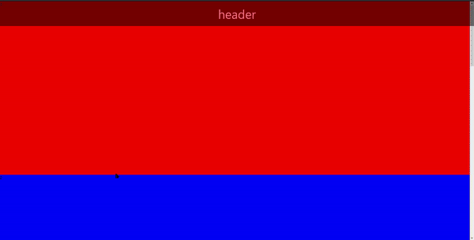
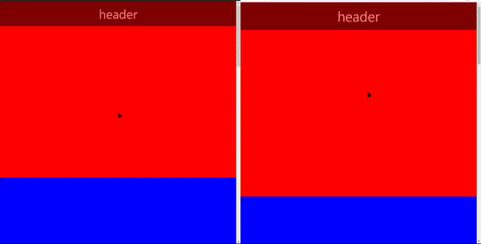

홈페이지 개발을 진행하는데 메인페이지를 어떻게 디자인할까 고민하다가 스크롤을 약간만 해도 스크롤이 부드럽게 움직여서 고정되는 기술(Scroll snap)을 site of the day의 어떤 페이지에서 본 기억을 가지고 그것을 구현해보려고 했다. 하지만 느낌으로 찾기는 어려웠고 검색에 검색을 거듭해서 결국 찾았다.


_구현하고 싶었던 Scroll snap(fullpage.js)_ 

처음 봤었던 `fullpage.js`는 구현하고 싶었던 것 그 자체였다. 쓰기 쉽고, 최근까지도 커밋내역이 있을 정도로 활발한 오픈소스이기 때문에 장점은 충분했다.

하지만 단점 또한 존재했다.  첫번째로 `jQuery`로 만들어졌다는 것이 문제였다. `Gatsby`로 구현중이였기 때문에 정적페이지로 빌드되므로 패키지의 크기가 작으면 작을 수록 좋은데 `fullpage.js`는 `jQuery`로 만들어져있기 때문에 패키지의 크기가 생각한 것보다 커질 수 있다. (그리고 개인적으로 `jQuery`를 싫어하기때문에..)


_음.....어...._

두번째로는 오픈소스임에도 상업적 목적으로 사용하려면 유료로 돈을 내야하는 점이 있다. 물론 이것을 구현하기 위해 살 수도 있지만 첫 페이지에만 쓰는데 라이선스를 사는 것이 불필요한 것 같아서 결국 다른 것으로 대체하기로 결정했다.

다시 검색하던 와중에 이전 [Mozilla Developer RoadShow](https://ethansup.net/blog/mozilla-developer-roadshow-2019)에서 본 `snap-scroll-type`이 생각났다. 해당 css를 구현한 것을 봤을 때 내가 원하는 대로 돌아갔던 것을 확인했었고, CSS로만 구현하기 때문에 여타 다른 라이브러리가 필요하지 없고 비용을 지불할 필요도 없기 때문에 CSS로 구현하는 것을 택했다.


_snap-scroll은 중요한 브라우저에는 모두 구현되어있다(IE 빼고)_

# TL;DR - 그래서?

한 줄로 요약하자면..


_사람들이 안 쓰는데 이유가 있다_

CSS의 `snap-scroll`은 Firefox에서는 정상적으로 돌아갔다. 약간만 내려도 다음 `div`로 고정이 되면서 스크롤이 넘어갔다. 애니메이션도 적절하고 프레임도 매끄럽게 흘러갔다(끊기지 않는다는 뜻). 정말 완벽했다.


_크롬의 통수(왼쪽: Firefox 78, 오른쪽: Chrome 84)_

하지만 Chrome을 간과하고 있었다. 개발을 끝마치던 중, Chrome을 키고 테스트를 하자 Firefox의 애니메이션과는 다르게 내가 스크롤 하는게 끝나고 그 다음 애니메이션이 시작하기 전까지의 지연되는 시간이 인지할 만큼 긴 것을 확인할 수 있었다.. 개발은 모두 끝났는데...

그래서 이번 포스트의 제목이 CSS로 fullpage.js를 대체하기가 아닌 삽질기가 된 이유는 크롬에서 테스트를 하지 않고 개발을 완료한 글쓴이의 멍청함때문이다. 이제 CSS의 Scroll snap관련 속성들을 간단하게 소개하고 어떻게 적용했는지에 대해 쓰려고 한다.

# CSS Scroll snap

Scroll snap에 관련된 속성은 크게 네가지가 있다.

- Scroll container(`overflow: scroll`인 컨테이너)에 넣는 속성
  - `snap-scroll-type`
  - `snap-scroll-padding`
- 자식 요소에 넣는 속성
  - `snap-scroll-align`
  - `snap-scroll-margin`

### snap-scroll-type

```
snap-scroll-type: none | [ x | y | block | inline | both ] [ mandatory | proximity ]?
```
`snap-scroll-type`은 컨테이너에서 Scroll snap을 할 축과 엄격도를 정한다.  첫번째에 넣는 값으로는 x, y축 혹은 block축, inline축 등으로 정할 수 있다. 두번째로는 `mandatory`를 넣어 항상 snap point에 놓이도록 무조건 Scroll snap이 되도록 할 수 있고 `proximity`를 넣어 사용자의 스크롤을 우선시할 수 있다.


_mandatory와 proximity의 차이(좌: mandatory, 좌: proximity)_

### snap-scroll-align

```
scroll-snap-align: [ none | start | end | center ]{1,2};
```

`snap-scroll-align`은 Scroll container의 자식요소가 어디서 snap해야 하는지 알려준다. Scroll container의 viewport에서 해당 축을 기준으로 어디에서 snap해야할지 알려준다. none인 경우 snap하지 않고, start/center/end는 자식요소에서 snap할 위치를 축을 기준으로 맨 앞/중간/맨 뒤로 설정한다.


_snap-scroll-align start/center/end의 차이_

### scroll-margin/padding

```
scroll-margin: [ <length-percentage> | auto ]{1,4};
scroll-padding: [ <length-percentage> | auto ]{1,4};
```

Scroll container의 viewport에서 snap하는 곳에서 \<length-percentage\>만큼 띄우도록 한다. `padding`은 모든 자식요소에 적용되지만 `margin`은 개별 자식요소에 적용된다. 

# 시도1 : container에 snap-scroll 넣기

먼저 제목에도 적혀있듯이 순수 HTML과 CSS로 진행한 것이 아니라 React 프레임워크에서 진행했다(위에서 봤듯이 Chrome은 애니메이션이 이상하므로 테스트는 Firefox에서 진행했다). 그래서 스크롤할 내용물의 부모가 `body`태그가 아닌 `div`이기 때문에(`body`태그에 바로 렌더링할 수 있지만 [권장하지 않는다고 한다](https://github.com/facebook/create-react-app/issues/1568).) 그래서 처음 한 시도는 snap container를 새로 만들어서 스크롤할 내용물을 넣는 것이였다.

```jsx{codeTitle: "App.js"}{10,16}
import React from 'react';
import './App.css';

function App () {
  return (
    <>
      <header className="header">
        header
      </header>
      <main className="scroll-container">
        <div style={{backgroundColor: 'red'}}>1</div>
        <div style={{backgroundColor: 'blue'}}>2</div>
        <div style={{backgroundColor: 'orange'}}>3</div>
        <div style={{backgroundColor: 'green'}}>4</div>
        <div style={{backgroundColor: 'yellow'}}>5</div>
      </main>
    </>
  )
}
```

```css{codeTitle: "App.css"}{15-17,21}
header.header {
  width: 100%;
  height: 100px;
  line-height: 100px;
  text-align: center;
  position: absolute;
  background-color: black;
  opacity: 0.5;
  color: white;
  font-size: 50px;
}

main.scroll-container {
  height: 100vh;
  scroll-snap-type: y mandatory;
  scroll-padding-top: 100px;
  overflow-y: scroll;
}

main.scroll-container > div {
  scroll-snap-align: start;
  border-top: 1px solid red;
  height: 700px;
}
```


_시도1의 결과(Firefox 78)_

Firefox에서 작동은 잘 되지만 header가 스크롤 위에 있어 만약 header가 `opacity: 0.5;`속성이 없다면 보기에 안 좋아지므로 다른 시도를 하기로 했다.

# 시도2: html에 snap-scroll 넣기

header가 스크롤 위에 가지 않도록 html 태그의 스크롤을 활용해서 Scroll Snap을 구현하는 것을 시도해보았다.

```jsx{codeTitle: "App.js"}
import React from 'react';
import './App.css';

function App () {
  return (
    <>
      <header className="header">
        header
      </header>
      <main>
        <div style={{backgroundColor: 'red'}}>1</div>
        <div style={{backgroundColor: 'blue'}}>2</div>
        <div style={{backgroundColor: 'orange'}}>3</div>
        <div style={{backgroundColor: 'green'}}>4</div>
        <div style={{backgroundColor: 'yellow'}}>5</div>
      </main>
    </>
  )
}
```

```css{codeTitle: "App.css"}{1-6,13,21}
    html {
      height: 100vh;
      scroll-snap-type: y mandatory;
      scroll-padding-top: 100px;
      overflow-y: scroll;
    }

    header.header {
      width: 100%;
      height: 100px;
      line-height: 100px;
      text-align: center;
      position: fixed;
      background-color: black;
      opacity: 0.5;
      color: white;
      font-size: 50px;
    }

    main > div {
      scroll-snap-align: start;
      border-top: 1px solid red;
      height: 700px;
    }
```

Firefox는 스크롤과 header가 분리되어있고, Scroll Snap도 정상적으로 작동하였다. 하지만...


_또 Chrome의 통수...(왼쪽: Firefox 78, 오른쪽: Chrome 84)_

Chrome에서 테스트했을 때 스크롤 할 때마다 여러개의 자식요소들이 한꺼번에 지나가는 현상을 볼 수 있었다.

# 시도 3: container에 snap-scroll 넣기 + 모든 스크롤 바 없애기

그래서 시도1의 코드에서 Snap container의 스크롤 바를 없애는 방식으로 스크롤 위에 header가 생기는 것을 방지하기로 했다.

```jsx{codeTitle: "App.js"}
import React from 'react';
import './App.css';

function App () {
  return (
    <>
      <header className="header">
        header
      </header>
      <main className="scroll-container">
        <div style={{backgroundColor: 'red'}}>1</div>
        <div style={{backgroundColor: 'blue'}}>2</div>
        <div style={{backgroundColor: 'orange'}}>3</div>
        <div style={{backgroundColor: 'green'}}>4</div>
        <div style={{backgroundColor: 'yellow'}}>5</div>
      </main>
    </>
  )
}
```

```css{codeTitle: "App.css"}{18-19,22-25}
header.header {
  width: 100%;
  height: 100px;
  line-height: 100px;
  text-align: center;
  position: absolute;
  background-color: black;
  opacity: 0.5;
  color: white;
  font-size: 50px;
}

main.scroll-container {
  height: 100vh;
  scroll-snap-type: y mandatory;
  scroll-padding-top: 100px;
  overflow-y: scroll;
  scrollbar-width: none;
  -ms-overflow-style: none;
}

main.scroll-container::-webkit-scrollbar {
  width: 0;
  background-color: transparent;
}

main.scroll-container > div {
  scroll-snap-align: start;
  border-top: 1px solid red;
  height: 700px;
}
```


_하긴 했는데..(왼쪽: Firefox 78, 오른쪽: Chrome 84)_

그나마 만족한 결과가 나왔다. header가 스크롤을 가리지 않고, 애니메이션이 매끄럽게 흘러간다(Chrome은 덜 매끄럽지만). 물론 fullpage.js를 사용했다면 쉽게 매끄러운 애니메이션을 구현할 수 있었겠지만 CSS로 한번 구현해보고 싶었다. Chrome 84버전에서는 덜 매끄러운 애니메이션이 나오면서 fullpage.js의 대체를 하지 못했지만 이후 버전에서는 애니메이션을 개선하여 대체하는 때가 왔으면 좋겠다.


_적어도 이 소리는 안 나왔으면 좋겠다._