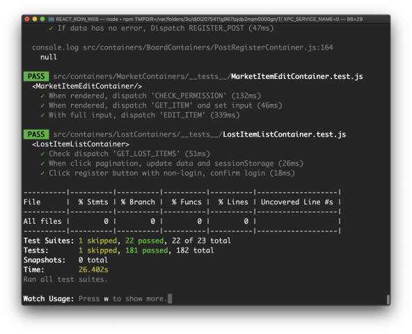
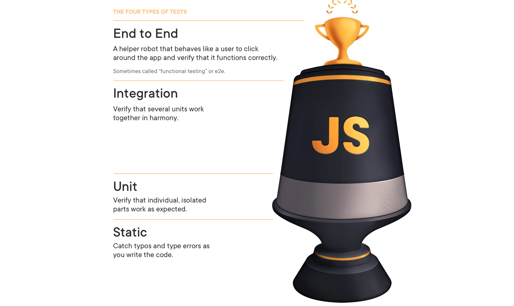
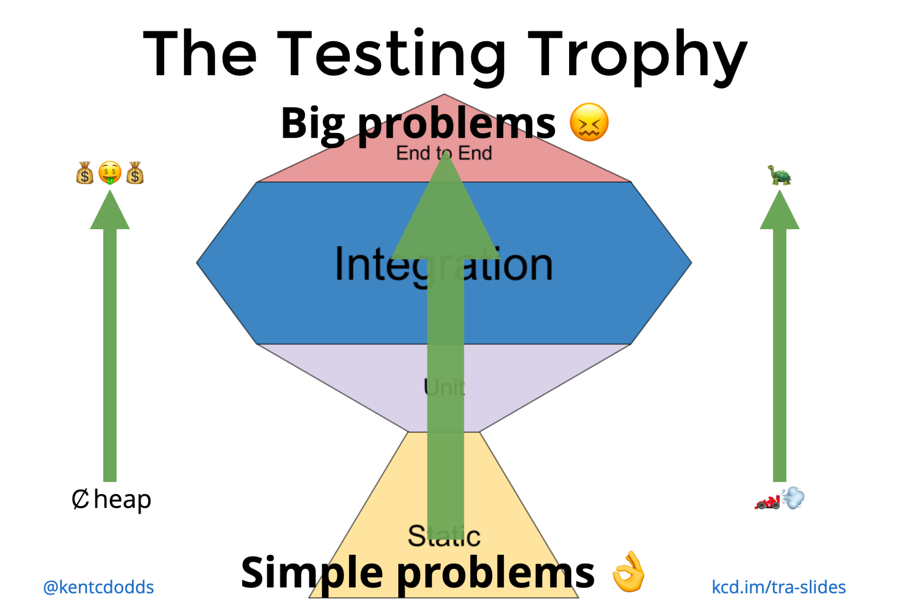
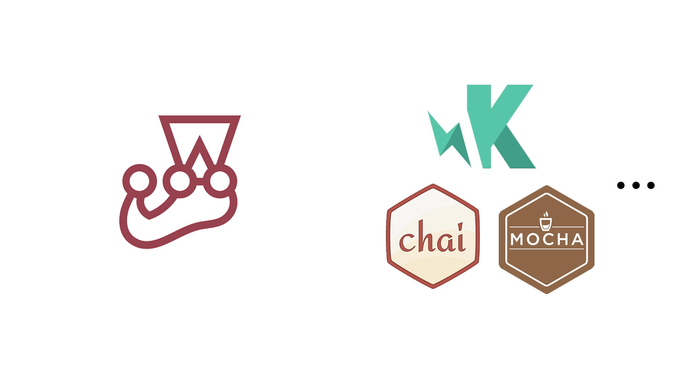
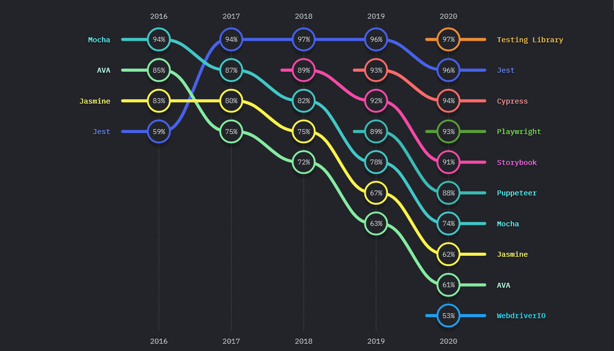
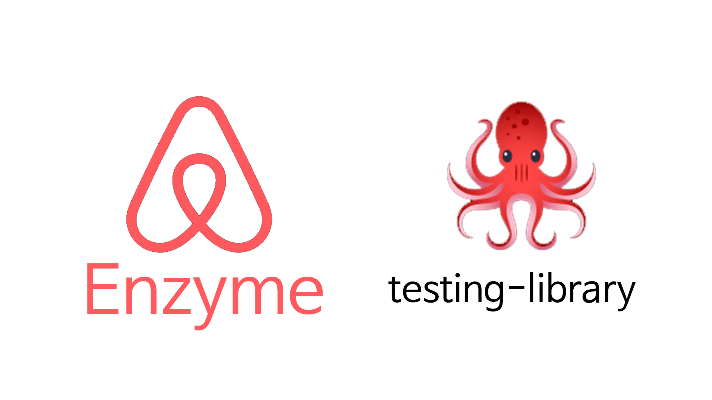

# 글을 시작하기 전에

이 글은 학교 커뮤니티 서비스인 코인의 테스트 적용기이다. 기존 프로젝트에 테스트를 어떻게 적용하는지를 쓰면 도움이 될 사람이 있을 것이라 생각하여 시간이 많이 지났음에도 글을 적는다. 

아쉽게도 지금은 코인의 기능을 축소하면서 작성한 테스트가 거의 다 사라졌다.

_당시 작성한 테스트들(2020.06~2020.07)_

테스트를 적용하기 전에 왜 갑자기 기존 프로젝트에 테스트를 적용하게 되었는지와 테스트의 종류와 어떤 라이브러리를 선택했는지를 살펴볼 것이다.

# 왜 테스트를 적용했나

테스트를 적용하기 이전에는 손수 QA를 스테이지 서버에서 몇 일동안 진행했어야 했고, 프론트엔드 파트만 QA를 담당한 것이 아니라 멘토분들도 QA를 해주셨다(지금 생각해보면 말도 안됐다). 게다가 QA를 했음에도 불구하고 실 서비스에서 버그가 생겨서 핫픽스를 여러번 경험하였다. 그래서 프론트엔드 파트의 멘토분이 기존 프로젝트인 코인에 테스트를 적용하고 다음부터 기능구현할 때부터 테스트를 작성하여 버그를 줄여보자고 제안하였다. 

# 테스트의 종류

`Testing-Library`를 만든 kent c. dodds는 테스트를 네 가지 종류로 정의했다. 정적 테스트, 유닛 테스트, 통합 테스트, 종단 간 테스트로 나누었다.

_kent c dodds가 만든 Testing Trophy_

- 정적 테스트: ESLint같은 오타를 수정해주거나, TypeScript같이 타입을 올바르게 쓸 수 있게 해주는 도구로 테스트한다.
- 유닛 테스트: 함수/클래스같은 개별 유닛에 값을 넣고 예상한 값이 나오게 하도록 테스트한다.
- 통합 테스트: 유닛들을 합친 묶음(ex. 컴포넌트)이 side effect를 포함해서 원하는 목표가 나오도록 테스트한다.
    - 통합 테스트에서는 보통 전체 어플리케이션을 테스트하지 않고 mocking을 많이 사용한다(mocking에 대해서는 다음 섹션에서 설명한다) .
- 종단간 테스트: 시나리오대로 테스트했을 경우 해당 제품이 잘 돌아가는지 테스트한다.
    - 종단간 테스트에서는 전체 어플리케이션을 렌더링한다.

> 출처: [https://kentcdodds.com/blog/the-testing-trophy-and-testing-classifications](https://kentcdodds.com/blog/the-testing-trophy-and-testing-classifications)

정적 테스트에서 종단간 테스트로 갈 수록 테스트에 쏟는 비용이 높아진다. 그래서 kent c. dodds는 testing trophy만큼의 테스트를 작성하는 것을 권장하고 있다(유닛 테스트와 종단간 테스트는 적게 하고 통합테스트를 많이 작성하도록).

_트로피 위로 올라갈 수록 비용이 많이 들고, 속도가 느려지고, 문제가 커진다는 것을 표현하고 있다_

# 테스트 기능의 종류

테스트 라이브러리가 지원하는 기능이 모두 다 다르기 때문에 알맞은 라이브러리를 합쳐서 사용해야 한다.

- Test launcher: 테스트를 시작하는데 사용되며 테스트 환경 설정 및 작성에 이용된다.
- Testing structure provider: 테스트를 읽고 확장할 수 있는 방향으로 정렬하는 걸 돕는다.
- Assertion functions: 테스트가 예측한 대로, 그리고 명확한 값을 반환하는지 확인한다.
- Generate and display test progress and summary: 테스트를 하고 경과를 보여준다.
- Mocks, spies, stubs: 시나리오를 테스트하기 위해 시뮬레이션을 돌리고/ 테스트 부분을 실제 제품에서 분리하고, 예상한 대로 작동하는지 빌드에 적용한다.
    - Mocks/Fakes: 모듈(전체)이나 행동을 대체한다(ex. 서버에서 받아오는 json을 대체함).
    - Stubbing or Dubbing: 원활한 테스트를 위해 모듈의 함수를 대체한다.
    - Spies: 해당 함수가 언제, 어디서, 누구에게서 호출되었는지 파악하고 side effects를 명확하게 파악할 수 있다. 통합 테스트에 이용된다(예: state 벗어나서 생긴 메모리 누수 버그).
- Generate and compare snapshot: 지난 테스트와 비교하여 결과물이 일치하는지 테스트한다.
- Generate code coverage: 코드 중 얼마나 테스트를 하는지 확인한다.
- Browser Controllers: 기능 테스트를 위해 사용자가 사용하는 것을 시뮬레이션한다.
- Visual Regression Tools: 이미지 비교를 통해 사이트에서 어느 부분이 바뀌었는지 확인한다

> 출처: [https://medium.com/welldone-software/an-overview-of-javascript-testing-7ce7298b9870](https://medium.com/welldone-software/an-overview-of-javascript-testing-7ce7298b9870)

# Jest vs Karma + Mocha + Chai...

테스트 라이브러리하면 가장 먼저 떠오르는 것은 다름 아닌 `Jest`이다. `Jest`가 가장 먼저 떠오르는 이유는 기능이 매우 많아서 인데, 그 기능을 열거해보면 다음과 같다.

- 기본적인 matcher를 통해 값 예측을 지원한다.
- 비동기 코드 테스트를 지원한다.
    - callback에서 done이 호출될 때까지 대기(done / done(error))
    - `it` 함수(테스트 케이스 설명과 테스트 케이스 함수를 받는 함수)가 비동기 함수를 받을 수 있다.
- Spies/Stub/Mock/Clock(타이머 시간 돌리기) 기능을 지원한다.
- Snapshot 기능을 지원한다.
- `__test__`, `__mocks__`로 파일 구조화가 가능하다.
- 테스트 실행

정말 많은 것을 `Jest` 혼자 담당하니 많은 설정 없이 바로 쓸 수 있어 많은 사람들이 만족도 높게 사용한다.

_State of JS 2020의 테스트 부분_

그에 비해 테스트 라이브러리로 `Mocha`를 선택하면 많은 라이브러리를 조합해야 한다. 그 이유는 `Mocha`가 지원하는 기능이 제한적이기 때문이다.

- 비동기 코드 테스트를 지원한다.
- BDD / TDD..를 위한 여러가지 인터페이스를 제공한다.

기능이 제한적이여서 유연하다는 장점은 있다. 그래서 Test Runner인 `Karma`나 matcher를 지원하는 `Chai` 등을 조합해서 사용한다. 하지만 테스트를 처음 작성하는 사람에게는 이 많은 라이브러리를 설치하고 설정하는 것이 고역이 될 수 있다.

# testing-library vs Enzyme

`Testing-Library`와 `Enzyme`은 React 컴포넌트의 테스트를 돕는 라이브러리이다. `Enzyme`은 오래 전부터 react를 테스트하는데에 쓰이고 있고, react-testing-library는 2018년에 새로 나온 라이브러리이다.

`Enzyme`은 `Testing-Library`가 나오기 전 Airbnb에서 만든 리액트 테스팅 라이브러리이다. 실제 DOM이 아니라 가상 DOM을 기준으로 테스트를 작성해야한다. 그래서 보통 컴포넌트의 상태가 올바른지를 확인하는 구현 주도 테스트(Implementation Driven Test, 어플리케이션의 상태을 중점으로 테스트하는 것)에 적합하다고 한다.

`Testing-Library`는 JSDOM을 통해서 실제 DOM을 렌더링하도록 react 컴포넌트를 가져와서 render함수를 통해 mount해서 사용하고 cleanup함수로 지우는 역할을 수행한다. `Testing-Library`는 `Enzyme`과 다르게 상태를 중심으로 확인하지 않고 올바른 결과나 DOM이 나왔는지 확인하는 행동 주도 테스트(Behavior Driven Test, 어플리케이션의 결과를 중점으로 테스트하는 것)에 적합하다고 한다. 보통 react-testing-library와 생태계로 있는 user-event와 jest-dom을 같이 쓴다.

> 출처: [https://www.daleseo.com/react-testing-library/](https://www.daleseo.com/react-testing-library/)

# 무엇을 선택하게 되었나

사실 CRA로 프로젝트를 만든 시점부터 `Jest`와 `Testing-library`를 선택하는 것은 피할 수 없다. 그럼에도 테스트 라이브러리가 무엇이 있는지 알아본 이유는 테스트 라이브러리를 사용하고 있는 이유를 알아놓아야 하고, 테스트를 같이 작성하는 팀원도 처음임을 고려해야하기 때문이다.

## Jest + Testing-Library

`Jest`와 `Testing-Library`를 선택한 가장 큰 이유는 테스트를 처음 작성하는 입장에서 설정할 것이 거의 없어 테스트 작성에만 집중할 수 있다는 것은 최고의 혜택이라고 생각한다. 그런 의미에서 `Jest`와 `Testing-library`는 좋은 선택이라고 생각하였다. 그리고 행동 주도 테스트가 구현 주도 테스트보다 테스트 작성이 쉬울 것으로 예상되어 이 조합으로 결정을 하였다(그리고 당시 `Enzyme`이 hooks관련 문제가 있던 것으로 기억한다).

## Snapshot 테스트를 하지 않은 이유

코인의 UI가 자주 바뀌었기 때문에 적용하지 않는 것으로 결정하였다. Snapshot 테스트는 이전 테스트의 DOM결과와 비교해 DOM이 변경되었는지 확인하여 변경되었을 때 오류를 뱉는 테스트다. 그래서 UI가 변경되었다면 결과 Snapshot이 변경되어 업데이트해주어야 한다. 그래서 UI가 자주 바뀌기 때문에 Snapshot 테스트에 들이는 비용에 비해 얻는 것이 없을 것으로 예상되어 적용하지 않았다. 같은 이유에서 `StoryBook`도 적용하지 않았다.

## E2E 테스트를 하지 않은 이유

첫번째 이유는 E2E 테스팅 라이브러리로 가장 유명한 `cypress`가 여러명이서 사용하려면 유료이기 때문인 것이 가장 컸다. 나름 (학교에서) 큰 서비스를 운영하는 동아리지만 동아리 차원에서 학교 안의 한 서비스를 위해 유료인 `cypress`를 적용하기에는 부담이 되었다. E2E 테스트에 쏟는 비용에 비해 서비스가 작아 딱히 얻는 장점이 없을 것으로 예상되는 것이 두번째 이유이다. 그래서 다른 E2E 테스트 라이브러리를 적용하기에도 문제가 있다.

# 첫번째 글을 마치며

이외에도 식견을 넓히기 위해 `Jasmine` 이나 `Qunit`, `puppeteer`도 알아보았지만 여기에 적지 않은 이유는 다음과 같다.
- `Jasmine`은 `Jest`를 만드는데에 영감을 준 라이브러리다. `Jest`와 기능이 많이 겹치고, `Jest`가 더 기능이 많고 설치하기 쉬워서 `Jest`를 선택하지 않을 이유가 없었다. 그리고 문서도 좀 낡았다. 문서 예제가 아직도 XMLHttpRequest`였다.
- `Qunit`은 `JQuery`를 테스트하기 위한 테스트 라이브러리이다.
- `puppeteer`는 테스팅 라이브러리가 아닌, Chrome을 제어하는 API를 제공하는 headless 브라우저 라이브러리이다. 브라우저 API에 쉽게 접근할 수 있도록 돕는 라이브러리로서, E2E 테스트하는데 쓰인다.
  
다음 글에서는 CRA로 만들어진 프로젝트에서 redux, react-router가 적용되었다고 가정하고 테스트를 진행하는 방법을 알아보겠다.

 ### 또 다른 자료들의 출처

- [https://blog.logrocket.com/comparing-react-testing-libraries/](https://blog.logrocket.com/comparing-react-testing-libraries/)
- [https://kentcdodds.com/blog/static-vs-unit-vs-integration-vs-e2e-tests](https://kentcdodds.com/blog/static-vs-unit-vs-integration-vs-e2e-tests)
- [https://meetup.toast.com/posts/174](https://meetup.toast.com/posts/174)